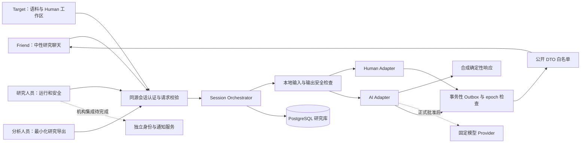

# 架构、需求与信任边界

完整服务采用 Next.js App Router、TypeScript、PostgreSQL / Prisma 和持久化 Node / Socket.IO。合成研究演练默认使用虚构人物、语料和事件，研究 AI adapter 不连接外部模型。真人准备区与可使用本地模型的五轮游戏分别运行，不能据此启用正式研究。

原始研究输入仅保留在本机，不公开到源码仓库或网页；这里记录实现合同与边界。开发完成不授予真人研究权限，未知批准项保持缺失。

## 模块与数据隔离

Research / Target / Friend 提供独立页面，用户名/密码 Account 关联 Participant，AuthSession 新增 portal 字段。三个独立 HttpOnly Cookie 与固定角色共同授权。EnrollmentInvitation 用散列 token、7 天有效期与单次消费管理注册；PreparationRoom / PreparationMessage 保存真人准备聊天，与 Session / Message 正式实验模型分离。

`src/server/portals.ts` 承担真实账号、邀请、个人资料、同意、准备聊天室及退出；`/api/portal` 负责严格请求校验和门户认证。研究端只读准备进度，不读取私人正文。真实 Target / Friend 在旧 `/api/study` 及 engine 层同时拒绝；演练聚合只纳入无 Account 的 demo 参与者，审计排除 PORTAL_ 事件。新模型迁移为 `202609060003_portal_enrollment`。详细授权和接口见 [FEATURES.md](FEATURES.md)。

五轮文字游戏由 `src/server/play.ts`、`play-auth.ts` 和 `play-provider.ts` 实现，使用独立游戏资料、房间及消息。游戏账号可复用 Target 会话，但自助注册不自动加入研究名单；游戏模型与下述正式研究 provider 分离。

完整在线服务需要持久 Node 进程、PostgreSQL 和模型接口；GitHub Pages 仅支持静态文件，不能承载账号、聊天或模型 API。在线部署模板与实际已上线服务必须区分。下图及后文描述合成研究演练引擎。

## 组件与边界



- 浏览器是不可信调用方。角色来自服务端登录会话，不接受 body 中的 actor / role；每次读取、发送、重连和控制动作均重新验证对象所属关系。
- `src/server/auth.ts` 负责 HttpOnly、SameSite Cookie、令牌哈希和过期；`src/server/http.ts` 负责 Origin、请求体和错误响应边界。默认 HTTP 只供回环地址合成演示，机构部署必须使用 TLS / Secure Cookie。
- `src/server/engine.ts` 是唯一研究事务入口。Prisma 实体不能原样进入 Friend 组件；不同角色的输出必须经过明确字段选择。`src/domain/state-machine.ts` 给出共享生命周期与公开消息合同。
- 模型只见一个 Target 的冻结风格、获批准 BUILD 知识和当前场次上下文。知识必须同时匹配 target / persona version / approval / partition；输入在外发前完成本地检查。无工具、文件系统、邮件、转账或外部行动接口。
- 合成项目没有真实联系方式表，也不从社交平台抓取记录。机构 Identity Service、专用数据库账号、加密与密钥管理是正式集成项，不能把不收集真实身份的演示等同于完成生产身份隔离。

## 目录

```text
src/app/                  Next.js 页面、布局和同源 API
src/components/           角色工作台与共享 UI
src/domain/
  types.ts                私有领域类型与受控错误
  randomization.ts        固定候选集、种子、配额、约束求解与散列
  privacy.ts              本地扫描、边界保留、散列和重复组分区
  safety.ts               共用多语言规则与研究提示
  config.ts               无批准默认值的 LIVE 配置 schema
  state-machine.ts        状态转换、epoch、交付时刻、grapheme、公开消息
  provider.ts             合成 adapter 与受控 Anthropic adapter
  instruments.ts          量表范围、缺失、pAI 与 CSV 单元格
src/server/               main.ts 持久服务入口、认证、Prisma 和研究工作流
prisma/schema.prisma      完整关系模型
prisma/migrations/        初始迁移、约束和冻结保护
scripts/                  本地 PostgreSQL、迁移与合成种子启动
scripts/testing/          HTTP、导航和生产验证脚本
tests/                    领域与数据库内核测试
deploy/                   Docker / Compose 与部署配置
guide/                    功能、架构与验证文档
.cache/                   本地构建及测试缓存，不进入仓库
```

## 状态、停止与交付事实

标准状态为 `SCHEDULED → READY → ACTIVE`。技术暂停可重新执行启动检查；安全暂停只可进入人员联系或结束，不自动恢复为实验聊天。`STAFF_CONTACT` 是明确的研究人员处理状态，不标为 Human 场次。

暂停、人员接管、结束或退出使 `epoch` 递增，同时取消 generation 并作废待交付 outbox。生成调用返回时仍需核对原 epoch / turn；最终交付事务再次锁定 session 并检查 ACTIVE、epoch、同意、内容删除状态。即使网络取消失败，旧回调也不能交付。已交付正文的历史暴露事实不会被改写为“从未见过”。

交付时间采用：

```text
ready_at = max(generation_finished_at, safety_check_finished_at)
eligible_at = max(triggered_at + sampled_total_delay, ready_at)
overshoot = max(0, ready_at - (triggered_at + sampled_total_delay))
```

模型已用掉的时间不会重复等待。Human 不加拟人延迟。合成演示的等待值用于验证机制，不能代替获批准的个人基线拟合或正式时序容差。数据库分别保留生成完成、服务端交付和客户端 ACK；客户端时钟不负责授权、安全或排序。

## 公开 DTO 与盲法

公开消息字段为 `id, role, text, sequence, deliveredAt`；工作台可附客户端确认状态。公开 role 只允许 `FRIEND | SOURCE | STUDY_NOTICE`。所有来源查询都发送相同的研究提示：

> 这项研究暂不揭示当场来源；你可以继续、跳过或结束。

直接要求退出、停止盲测或完整说明时进入停止 / debrief，不重复来源提示来阻止退出。浏览器默认无 typing、online、read receipt 或逐 token 输出。Friend 数据不包含模型名、provider、私有 condition、seed、来源配额、后续分配或剩余来源计数。Target 必然知道自己手动回复的场次；研究人员可以为运行与安全知道来源，因此本设计不声称双盲。

公开 API、Socket.IO、同源 polling、SSR / RSC、页面资源、错误、Cookie 和 URL 都属于泄漏测试范围。DTO 单元测试只能证明已测字段路径，不能证明其他路径、时间差或参与者判断完全不可辨识。独立设备、网络与人工红队仍是正式门槛。

## 权限矩阵

| 角色       | 允许                                                 | 默认禁止                                            |
| ---------- | ---------------------------------------------------- | --------------------------------------------------- |
| Friend     | 自己 dyad 的聊天、个人问卷、撤回、同意与获准二级任务 | 私有来源、配额、别人的会话、Target 构建语料         |
| Target     | 自己的语料和版本、自己的 Human 工作区                | Friend 问卷、区组结束前的 AI 正文、未获双方许可片段 |
| Researcher | 运行、授权安全处理、冻结配置、受控研究导出           | 从演示身份切换推导正式认证或身份库任意访问能力      |
| Analyst    | 去标识化、可屏蔽来源的结构化数据                     | 通信身份、原始正文、安全证据、运行控制              |

合成角色选择器只在明确的 synthetic 环境且回环地址或演示访问密钥检查通过时开放。正式认证必须接入机构身份提供者和权限分配流程，不能沿用演示选择器。

## 冻结、分区与随机化

导入逐条消息，不拼接为新段落。所有导入默认 `PENDING`，本地扫描结果仅供编辑 / 审核；扫描没有命中也不自动批准。近重复文本先形成连通组，同组不得跨 BUILD / DEV / HOLDOUT。HOLDOUT 不用于 persona、检索、开发预览或时序拟合，LIVE 不用于在线学习。冻结保留版本选择；撤回可销毁冻结版本的敏感正文，失效后不允许重建使用。

`generatePlan(seed)` 生成 36 dyads、216 sessions，返回完整私有分配、算法版本、候选集 hash、solution hash 和 balance report。五话题三选：10 个组合各三次，其中六个固定候选组合再一次；seed 随机置换话题标签与 dyad。每 dyad 三 Human / 三 AI，无同源三连，每个话题一 Human 一 AI。成对互补来源序列保证每个 position 恰为 18 Human / 18 AI。确定性坐标下降优化 topic × source × position 的平方和，要求每格 3 或 4 场；无法满足则抛出显式错误。话题 dyad counts 为 22/22/22/21/21，pair co-occurrence 10–12。

这属于可重复数学约束，不证明样本量足以支持统计结论。正式冻结仍需要研究者批准 seed 保管、可用时段、topic variants、测量、样本与停止规则、版本 manifest 及预注册。

## 二级分享、区组与撤回

TargetBlock 由 Target 的全部预定 dyads 推导完成状态。Target 的 source-known AI 评价只能在区组完成后且获双方 `TARGET_REVIEW` 许可时访问。完成一位 Friend 不能解锁其他仍未完成 Friends 的 AI 内容。

Offline 是独立任务，使用同一个固定 excerpt / context 的 familiar 和 unfamiliar 条件。熟悉角色相对 Target 而定，不是一个 rater 永久只有一个角色。原始 dyad Friend 不能评分自己的 excerpt；unfamiliar 必须明确 `knowsTarget=false`。两位原始参与者分享 scope 取交集，任一撤回使未完成任务失效。高风险事件或不合格隐私内容不能入池。正式抽样数量、重复评分、补覆盖和 staged debrief 时限没有批准默认值。

两种撤回模式明确分开：`ANALYSIS_EXCLUSION` 保留研究分母并排除分析；`CONTENT_DESTRUCTION` 清空正文和可控派生物，撤销片段与任务、使 export manifest 失效，并保留不含正文的 tombstone / audit stub。Audit 不记录自由文本理由、prompt 或 before/after 正文。恢复必须使用恢复快照之外的最新删除账本重新应用 tombstone；只恢复旧数据库会丢失新的删除事实。真实备份过期与外部已交付副本处置需机构协议，演示没有真实远端备份或第三方副本。

## Provider 与正式环境集成

Anthropic adapter 使用固定 `https://api.anthropic.com/v1/messages`、`anthropic-version: 2023-06-01`、非流式文本和固定日期 model ID，禁止 HTTP 重定向和工具。校验响应 model 与内部 JSON；拒绝、工具型输出、无效内容和模型漂移不重试。仅临时网络 / 服务错误允许获批上限内重试，最多两次。实现依据：[Messages API](https://platform.claude.com/docs/en/api/messages/create)、[Stop reasons](https://platform.claude.com/docs/en/build-with-claude/handling-stop-reasons)。供应商实际协议、模型可用性、region 与 retention 仍须逐项批准，未记录正式研究 provider 的真实 API 联调。

`liveConfigSchema` 要求伦理、同意、供应商、托管、安全、保留、测量、随机化、offline、独立验证与冻结证据各组均有批准记录且字段完整。它验证格式与缺项，不替机构认证批准文件真伪；正式启用需要获授权人审阅证据并完成机构集成。本版工作台仍保持合成运行。

## 需求覆盖与剩余验证

下列项目补充上述架构边界，详细测试结果统一见 [VERIFICATION.md](VERIFICATION.md)。

| 能力           | 实现与验收边界                                                                                                                                                  |
| -------------- | --------------------------------------------------------------------------------------------------------------------------------------------------------------- |
| 请求与会话安全 | `auth.ts` / `http.ts` 检查服务端身份、Origin、HttpOnly Cookie、实际字节上限、限流和受控错误；正式身份服务、TLS/密钥管理仍需部署集成。                           |
| 时间与文本合同 | `state-machine.ts` 使用 Unicode grapheme、epoch 与持久 outbox；复杂 emoji/组合字和 overshoot 已有自动测试，真实网络行为需独立验证。                             |
| 个人资料构建   | `onboarding` / `persona` 支持逐条语料、校准、DEV 预览、基线与冻结；正式 80–150 条语料、15–30 道校准题、5–10 次试问及支持数须按协议验收。                        |
| 隐私和安全规则 | `privacy.ts` / `safety.ts` 覆盖本地扫描、来源质询、退出、轻度情绪、危机和现实边界；中文、英文、混合、否定与引用有合成回归，规则不是完整敏感信息检测或临床认证。 |
| 量表与关系测量 | `instruments.ts` 与 surveys/relationship 保持独立量表、可跳过、pAI、分母及污染标记；范围/缺失已校验，正式版本和问卷理解须锁定。                                 |
| Debrief        | 支持 pre-debrief、提前停止与来源披露选择；不显示“友情分数”，不以完成问卷为退出条件。正式 staged window 仍需批准。                                               |
| 导出           | 六关联导出、字典、CSV 注入防护和 manifest；UTF-8，null 与空字符串分开，正文导出默认未授权。                                                                     |
| 版本固定       | 配置、模型、persona、prompt、调查、时序与分配需要 manifest；现有 hash/迁移保护禁止静默漂移，删除仍可使冻结内容失效。                                            |
| 验证材料       | 测试使用合成文本及 mock fetch。`UNIT-TEST-ONLY` 批准配置只检验 schema/adapter 结构，不是机构批准文件。                                                          |

## 正式部署前必须补齐的证据

1. 伦理审查路径、批准编号、PIS / consent、参与资格、补偿、退出和支持路径。
2. 机构托管、正式身份认证、独立身份服务、TLS、静态加密、密钥管理、最小数据库账号与网络 allowlist。
3. 供应商协议、精确模型快照、区域、保留 / ZDR适用范围和功能白名单。不能把 API 调用等同于零保留。
4. 值守与备援人员、服务时段、应答时限、地区资源以及安全演练。
5. 保留 / 删除 / 备份过期 / 外部副本协议，以及独立删除账本的恢复验证。
6. 正式 corpus / calibration / DEV负担，个人节奏拟合、独立 holdout、预定容差、设备与网络红队、metadata分类器分组留出与区间。
7. 样本精度 / 功效模拟、live与offline估计目标、话题版本、near-balanced seed保管、排期可用性、问卷顺序和缺失策略。
8. excerpt固定抽样、双方secondary-sharing、familiar/unfamiliar覆盖与停止规则、staged debrief时间窗、配额不披露与完整TargetBlock。
9. 正式 code commit、policy / persona / prompt / model / survey / timing / allocation manifest、预注册和获授权人发布审核。

## 解释限制

确定性约束通过说明已执行测试中的程序约束成立；它不证明聊天者无法区分来源，也不证明安全规则具有临床敏感度。没有发现直接字段泄漏不等于无所有工程线索。未显著高于50% 不等于不可辨别；未显著时序差异不等于等效。36 dyads / 216 sessions 不是 216 个独立 Target。familiar / unfamiliar不是随机分配的关系身份，same-stimulus 结果仍需谨慎解释。Target 自评和 Friend 评价保持相应知情条件，不自动当作匹配分差。
